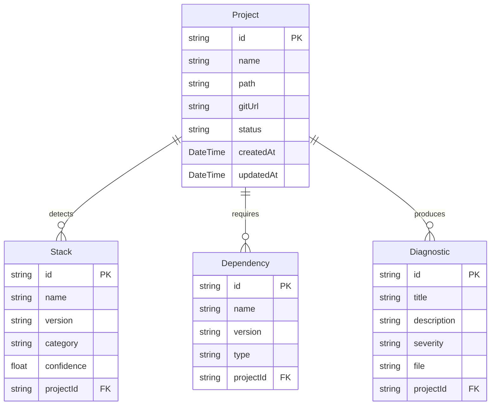

# 🩺 StackDoctor AI

> **Automated repository scanner, developer environment inspector, deterministic stack diagnostic engine, and AI-assisted remediation platform.**

[](frontend/)
[](backend/)
[](backend/prisma/)
[](backend/src/ai/)
[](cli/)

---

## 🌟 The Problem & The Solution

### The Developer Dilemma
When onboarding to a new codebase, downloading an open-source project from GitHub, or debugging a local setup, developers face a maze of environment friction:
- *What runtime versions are required? (Node 18 vs 22, Java 17 vs 21, Python 3.10 vs 3.12)*
- *Are required background services and containers actually running?*
- *Are required network ports (e.g. `5432`, `8080`, `27017`) already blocked by another process?*
- *What environment variables are expected in `.env`?*

### The StackDoctor Solution
StackDoctor bridges the gap between **Project Requirements** and **Local Machine Realities** through a seamless 5-stage automated pipeline.

---

## 🔄 The 5-Stage Core Pipeline

```
  ┌──────────┐      ┌───────────┐      ┌───────────┐      ┌────────────┐      ┌─────────┐
  │   SCAN   │ ──►  │  INSPECT  │ ──►  │  COMPARE  │ ──►  │  DIAGNOSE  │ ──►  │   FIX   │
  └──────────┘      └───────────┘      └───────────┘      └────────────┘      └─────────┘
   Repo / Path       Host Machine       Rules Match        Health & Docs       AI Engine
```

1. **SCAN (Repository Profiling):** Parses `package.json`, `pom.xml`, `requirements.txt`, `Dockerfile`, `docker-compose.yml`, and config files to extract required runtimes, dependencies, ports, and environment variables into a structured **Project Requirements Profile**.
2. **INSPECT (Host Environment Check):** Inspects the developer's actual computer (via CLI or built-in system tools) to capture an **Environment Snapshot** (active Node, Java, Docker, Git versions, port occupations, and OS details).
3. **COMPARE (Deterministic Rules Matching):** Compares project requirements against machine capabilities using deterministic JavaScript comparison logic (no hallucination or false positives).
4. **DIAGNOSE (Issue Categorization & Scoring):** Flags mismatches (e.g. `NODE_VERSION_MISMATCH`, `DOCKER_NOT_RUNNING`, `PORT_CONFLICT`), generates a dynamic **Health Score (0–100%)**, and prepares structured diagnostics.
5. **FIX (AI-Powered Remediation):** Feeds structured JSON diagnostics into **Google Gemini AI** to produce exact, copy-paste terminal fix commands, environment explanations, and interactive AI Chatbot troubleshooting.

---

## ✨ Key Features

### 🔍 Deep Repository & Stack Scanner
- Multi-ecosystem detector: **Node.js / JavaScript / TypeScript**, **Java (Maven/Gradle)**, **Python (Poetry/Pip/Pipenv)**, **Docker / Docker Compose**, and file extension scanners.
- Automatic extraction of service requirements (PostgreSQL, Redis, MongoDB, MySQL, RabbitMQ).
- Detection of port bindings, `.env.example` configurations, and security/runtime sensitivities.

### 💻 Developer CLI & System Inspector
- Lightweight CLI tool (`stackdoctor diagnose`) to run quick environment audits directly from your terminal.
- Instant detection of bound network ports, active Docker daemon status, and CLI runtime versions.

### 📊 Real-Time Diagnostic Dashboard
- **Live Health Score:** Dynamic score calculator rating the readiness of your developer setup.
- **Diagnostics Panel:** Severity-tagged issues (`error`, `warning`, `info`) with line-level file references.
- **Clone & Setup Guide:** Auto-generated step-by-step checklist to get any cloned repository running.
- **Pre-Clone Inspector:** Evaluate Git repositories before cloning them to disk.
- **Built-in AI Assistant Chat:** Context-aware interactive assistant to troubleshoot complex setup errors in real time.

### 🤖 Gemini AI Fix Generator
- Instant generation of platform-tailored terminal remediation commands (PowerShell, Bash, Zsh).
- Human-friendly explanations of why an environment mismatch occurred and how to resolve it safely.

---

## 🏗️ Project Architecture

```
stackdoctor/
├── frontend/                     # React + Vite Interactive Dashboard
│   ├── src/
│   │   ├── components/           # UI Modules (HealthScore, Diagnostics, AiFixModal, Chatbot)
│   │   ├── config/               # Centralized API Configuration (api.js)
│   │   ├── App.jsx               # Main Application Dashboard
│   │   └── index.css             # Tailwind / Modern Design System
│   └── package.json
│
├── backend/                      # Node.js + Express REST API
│   ├── prisma/
│   │   └── schema.prisma         # MongoDB Data Models (Project, Stack, Dependency, Diagnostic)
│   ├── src/
│   │   ├── ai/                   # Google Gemini AI Fix & Chat Integration
│   │   ├── controllers/          # Request Handlers (scan, chat, tools, diagnostics)
│   │   ├── detectors/            # Multi-stack detection modules (Node, Java, Python, Docker)
│   │   ├── diagnostics/          # Deterministic Rule Engine
│   │   ├── extractors/           # Port, Env, and Service extractors
│   │   ├── routes/               # API Router (/api/scan)
│   │   ├── scanner/              # Git cloner & repository file tree scanner
│   │   ├── services/             # Core scanning and database transaction services
│   │   ├── db.js                 # PrismaClient singleton instance
│   │   └── server.js             # Express server entry point
│   ├── .env                      # Backend environment variables
│   └── package.json
│
├── cli/                          # StackDoctor Command Line Interface
│   ├── src/
│   │   ├── inspectors/           # Local OS, Docker, and Tool inspectors
│   │   └── index.js              # Commander-based CLI entry point
│   └── package.json
│
├── .agents/                      # AI Agent Constitution & Custom Skills
│   ├── AGENTS.md                 # Agent Guidelines & Safety Rules
│   └── skills/
│       └── stackdoctor-scan/     # Programmatic repo-scanning custom skill
│
├── architectural_overview.md     # Deep-dive system architecture specification
├── AGENTS_AND_SKILLS.md          # Custom agent profiles and skill reference
└── README.md                     # Project overview and documentation
```

---

## 🗄️ Data Model (Prisma + MongoDB)



---

## 🚀 Quick Start Guide

### 1. Prerequisites
- **Node.js**: v18.0 or higher
- **MongoDB**: MongoDB Atlas Cluster (or local MongoDB Community Server)
- **Google Gemini API Key**: Free key from [Google AI Studio](https://aistudio.google.com/)

---

### 2. Backend Setup

1. Navigate to the backend directory:
   ```bash
   cd backend
   npm install
   ```

2. Configure environment variables in `backend/.env`:
   ```env
   PORT=5001
   DATABASE_URL="mongodb+srv://<username>:<password>@cluster0.xxxxx.mongodb.net/stackdoctor?retryWrites=true&w=majority"
   GEMINI_API_KEY="your_gemini_api_key_here"
   FRONTEND_URL="http://localhost:5174"
   ```

3. Generate the Prisma Client:
   ```bash
   npm run build
   ```
   *(Note: MongoDB with Prisma does not require migrations; `prisma generate` creates the typed client models).*

4. Start the backend server:
   ```bash
   npm run dev
   ```
   *Backend will run on **`http://localhost:5001`**.*

---

### 3. Frontend Setup

1. Navigate to the frontend directory:
   ```bash
   cd ../frontend
   npm install
   ```

2. Configure environment variables in `frontend/.env`:
   ```env
   VITE_BACKEND_URL=http://localhost:5001
   ```

3. Start the frontend development server:
   ```bash
   npm run dev
   ```
   *Open **`http://localhost:5174`** in your browser to access the dashboard.*

---

### 4. CLI Setup & Usage

To inspect your local machine directly from the command line:

```bash
cd ../cli
npm install
npm link
```

Run an instant diagnosis:
```bash
stackdoctor diagnose
```

---

## 📡 API Reference

| Method | Endpoint | Description |
| :--- | :--- | :--- |
| `POST` | `/api/scan` | Trigger a new repository or local path scan |
| `GET` | `/api/scan` | Retrieve a list of all scanned projects |
| `GET` | `/api/scan/:id` | Get full diagnostic details, stacks, and dependencies for a project |
| `POST` | `/api/scan/:id/re-run` | Re-scan and re-evaluate an existing project |
| `POST` | `/api/scan/fix` | Generate AI-driven remediation steps and terminal commands (Gemini) |
| `POST` | `/api/scan/chat` | Context-aware AI interactive troubleshooting chatbot |
| `GET` | `/api/scan/system-tools`| Inspect and return current host machine capabilities |
| `POST` | `/api/scan/pre-clone-inspect`| Fast inspect a remote Git URL before cloning |

---

## 🤖 Agent Rules & Custom Skills

StackDoctor is designed with native agentic workflows in mind:
- **Agent Rules:** Defined in [`.agents/AGENTS.md`](.agents/AGENTS.md) and [`.clinerules`](.clinerules) to enforce architectural boundaries, avoid destructive DB migrations, and preserve port assignments.
- **Custom Skills:** Documented in [`AGENTS_AND_SKILLS.md`](AGENTS_AND_SKILLS.md). Includes the `stackdoctor-scan` skill enabling AI agents to programmatically run repository health checks via the REST API.

---

## 📄 License

This project is licensed under the **MIT License**.
