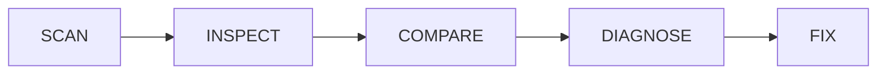

# StackDoctor AI — Architectural Overview

This document provides a comprehensive, high-level design of the StackDoctor AI project. It is intended to be easily explainable to both human developers and AI agents operating within this repository.

## 1. Technology Stack

StackDoctor is built using a modern full-stack JavaScript architecture:

*   **Frontend**: Built with **React** and **Vite**. It uses a component-based architecture to provide a real-time dashboard for scanning projects, viewing diagnostics, and interacting with AI fixes.
*   **Backend**: A REST API built with **Node.js** and **Express**. It handles the heavy lifting of cloning repositories, parsing files, running diagnostics, and communicating with the database and AI models.
*   **Database**: **MongoDB** is used as the primary data store, accessed via the **Prisma ORM**. MongoDB is hosted on Atlas for production flexibility.
*   **AI Integration**: Powered by **Google Gemini** (via `@google/genai`), which is used to generate human-readable remediation steps and CLI commands based on structured diagnostic JSON.

---

## 2. Data Model (Prisma / MongoDB)

The system relies on four primary models to track the state and health of scanned projects:

1.  **`Project`**: The core entity. It represents a single repository or local folder that has been scanned. It tracks the project's `name`, `path` (or Git URL), and current scan `status` (idle, scanning, completed, failed).
2.  **`Stack`**: Represents the technologies discovered within a Project (e.g., Node.js, React, Docker). It includes the `name`, detected `version`, `category` (Frontend, Backend, etc.), and a `confidence` score of the detection.
3.  **`Dependency`**: Represents specific packages or services required by the project (e.g., `express`, `mongoose`, `postgres` via Docker). It tracks the `name`, `version`, and `type` (npm, pip, docker).
4.  **`Diagnostic`**: Represents an issue found during the comparison phase. It includes a `title`, `description`, `severity` (info, warning, error), and potentially the `file` where the issue was detected.

---

## 3. High-Level Design: The 5-Phase Pipeline

StackDoctor operates on a strict, predictable 5-phase pipeline. 

### Phase 1: SCAN (Repository Scanner & Profile)
*   **What happens:** The backend receives a repository URL or local path. It recursively scans the files (e.g., `package.json`, `docker-compose.yml`, `pom.xml`) to determine what the project *needs* to run.
*   **Result:** A JSON **Project Requirements Profile** detailing required languages, services, ports, and environment variables.

### Phase 2: INSPECT (CLI Environment Inspector)
*   **What happens:** The system inspects the developer's *actual local machine*. It checks what is currently installed and running (e.g., "Is Docker running?", "What version of Node is installed?", "Is port 5432 open?").
*   **Result:** A JSON **Environment Snapshot**.

### Phase 3 & 4: COMPARE & DIAGNOSE (Diagnostic Engine)
*   **What happens:** The engine performs a deterministic, rule-based comparison (no AI involved yet) between what the project *requires* (Phase 1) and what the environment *has* (Phase 2).
*   **Rules Example:** If Project requires Node >=22, but Environment has Node 20.19.0, it throws a `NODE_VERSION_MISMATCH` error.
*   **Result:** A structured JSON list of `Diagnostic` objects saved to the database.

### Phase 5: FIX (AI Integration)
*   **What happens:** The structured JSON diagnostics are sent to the Gemini AI model. Gemini acts as an expert consultant, translating the raw JSON errors into step-by-step, human-readable explanations.
*   **Result:** The AI generates actionable Remediation Commands that are sent back to the frontend dashboard, allowing the developer to easily fix their environment.
